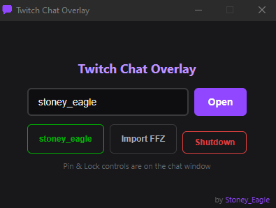
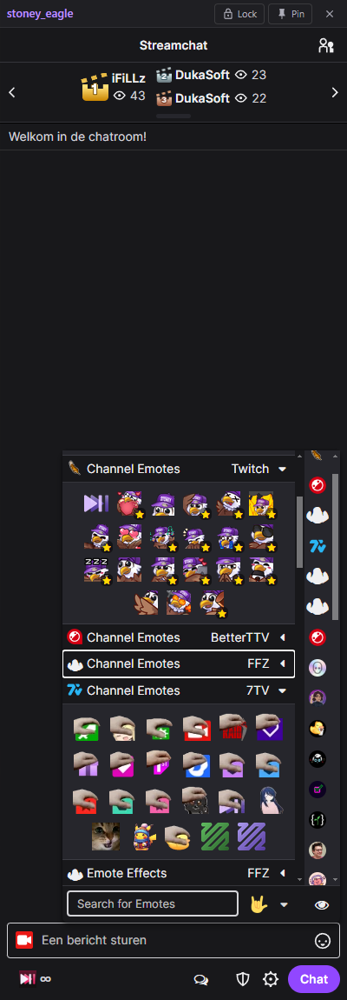

# TwitchDock

A lightweight Electron app that displays Twitch chat in a standalone, dockable window with full [FrankerFaceZ](https://www.frankerfacez.com/) support.


<p align="center">
  
  
</p>

## Features

- **Any channel** - Open chat for any Twitch broadcaster
- **FrankerFaceZ** - Full FFZ extension loaded natively (7TV, BTTV, custom emotes, badges)
- **FFZ settings import** - Import your FFZ settings from a JSON export
- **Multiple windows** - Open chat for multiple channels simultaneously
- **Transparency slider** - Adjust window opacity for overlay use
- **Pin (Always on Top)** - Keep chat above other windows
- **Lock** - Lock window position and size to prevent accidental moves
- **System tray** - Minimize to tray, double-click to restore
- **Twitch login** - Authenticate via Twitch to send messages
- **Persistent sessions** - Remembers your login, last channel, window position, opacity, and FFZ settings

## Getting Started

### Prerequisites

- [Node.js](https://nodejs.org/) 18+

### Install

```bash
git clone https://github.com/StoneyEagle/twitch-chat-overlay.git
cd twitch-chat-overlay
npm install
```

### Run

```bash
npm start
```

### Build

Build a portable executable for your platform:

```bash
npm run dist
```

Output goes to the `dist/` folder.

## Usage

1. **Login** - Click "Twitch Login" to authenticate (opens in-app)
2. **Open chat** - Type a channel name and click "Open"
3. **Control bar** - Each chat window has Lock, Pin, Opacity, and Close controls at the top
4. **Import FFZ** - Export your FFZ settings from the browser extension, then click "Import FFZ" to load them
5. **Tray** - Closing the main window hides it to the system tray. Right-click the tray icon to quit.

## Project Structure

```
twitchdock/
  assets/
    extensions/ffz/     # FrankerFaceZ Chrome extension
    icon.png            # App icon
  src/
    main.js             # Electron main process
    pages/
      index.html        # Launcher window
      index.css
      index.js
    preloads/
      preload-main.js   # IPC bridge for launcher
      preload-chat.js   # Chat window preload (FFZ settings)
      preload-twitch.js # Browser identity spoofing
  package.json
```

## License

MIT

---

*by [Stoney_Eagle](https://twitch.tv/Stoney_Eagle)*
